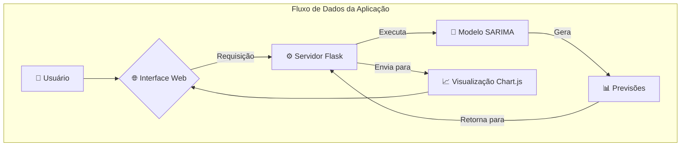

# 📊 Nubank Revenue Forecasting 🚀

<div align="center">


</div>

<div align="center">
  
  
  
</div>

---

## 🎯 **Sobre o Projeto**

Uma aplicação web inteligente que utiliza **Machine Learning** para prever a receita trimestral do Nubank! Com interface moderna e intuitiva, permite análises precisas de séries temporais usando o poderoso modelo **SARIMA**.

### ✨ **Destaques**
- 🔮 **Previsões Precisas**: Modelo SARIMA otimizado para dados financeiros
- 📈 **Visualização Interativa**: Gráficos dinâmicos com Chart.js
- 🎨 **Interface Moderna**: Design responsivo e user-friendly
- ⚡ **Performance Otimizada**: Carregamento rápido e processamento eficiente

---

# 🎬 **Demonstração da Aplicação**

<div align="center">

## 🚀 **Veja a Aplicação em Ação!**

### 🎥 **Navegação Completa (GIF)**


### 🌐 **Teste Agora - Demo ao Vivo**
<div>
  <a href="https://receita-nubank-projeto-machine-learnin-production.up.railway.app" target="_blank">
    
  </a>
  <a href="https://receita-nubank-projeto-machine-learnin-production.up.railway.app" target="_blank">
    
  </a>
</div>

### 📸 **Screenshots da Interface**

<table>
  <tr>
    <td align="center"><strong>🏠 Página Inicial</strong></td>
    <td align="center"><strong>📊 Dashboard de Previsões</strong></td>
  </tr>
  <tr>
    <td>
            
      <br/>
      <em>Interface intuitiva para configuração.</em>
    </td>
    <td>
            
      <br/>
      <em>Visualização avançada dos resultados.</em>
    </td>
  </tr>
  <tr>
    <td align="center"><strong>📈 Gráficos Interativos</strong></td>
    <td align="center"><strong>📱 Interface Mobile</strong></td>
    </tr>
  <tr>
    <td>
            
      <br/>
      <em>Charts dinâmicos com Chart.js.</em>
    </td>
    <td>
            
      <br/>
      <em>Design responsivo para todos os dispositivos.</em>
    </td>
  </tr>
</table>
---

## 🎯 **Guia Rápido da Demo**

<div align="center">

### 📋 **Em 3 Simples Passos**

</div>

| Passo | Ação | Resultado |
|:---:|---|---|
| **1️⃣** | **Acesse** → [Demo ao Vivo](https://receita-nubank-projeto-machine-learnin-production.up.railway.app/) | Interface carrega instantaneamente |
| **2️⃣** | **Configure** → Selecione 1-12 trimestres para previsão | Parâmetros ajustados automaticamente |
| **3️⃣** | **Visualize** → Clique em "Gerar Previsão" | Gráficos e relatórios em tempo real |

<div align="center">


</div>

---

## 🚀 **Funcionalidades**

| Funcionalidade | Descrição |
|---|---|
| 📊 **Previsão Inteligente** | Gera previsões para 1-12 trimestres futuros |
| 📈 **Visualização Avançada** | Gráficos interativos com dados históricos e previsões |
| 📋 **Relatórios Detalhados** | Tabelas com intervalos de confiança e métricas |
| 🎯 **Interface Intuitiva** | UX/UI otimizada para análise de dados |

---

## 🛠️ **Stack Tecnológica**

<div align="center">

| Backend | Frontend | ML/Data Science |
|:---:|:---:|:---:|
|  |  |  |
|  |  |  |
| |  |  |

</div>

---
---


## ⚡ Quick Start

Para colocar o projeto em funcionamento rapidamente, siga os passos abaixo:

### 📋 Pré-requisitos

Certifique-se de ter os seguintes softwares instalados em seu sistema:

- Python 3.8+
- pip (gerenciador de pacotes do Python)
- Ambiente virtual (altamente recomendado para isolar as dependências do projeto)

### 🚀 Instalação Rápida

Siga estas instruções para configurar e executar a aplicação:

#### 1. Clone o repositório

```bash
git clone https://github.com/jeancarlosde-lima/[NOME_DO_SEU_REPOSITORIO].git
cd [NOME_DO_SEU_REPOSITORIO]
```

*Lembre-se de substituir `[NOME_DO_SEU_REPOSITORIO]` pelo nome real do repositório, se necessário.*

#### 2. Crie e ative o ambiente virtual

```bash
python3 -m venv .venv
source .venv/bin/activate  # Para Linux/macOS
# .venv\Scripts\activate  # Para Windows (PowerShell)
```

#### 3. Instale as dependências

```bash
pip install -r requirements.txt
```

#### 4. Execute o servidor de desenvolvimento

```bash
./devserver.sh
```

*O script `devserver.sh` pode conter comandos como `flask run` para iniciar o servidor.*

<div align="center">
  
</div>


### 📱 Como Usar

Para utilizar a aplicação e gerar suas previsões de receita, siga os passos:

1.  **Defina o Período**: Escolha o número de trimestres (de 1 a 12) para os quais deseja gerar a previsão.
2.  **Execute a Análise**: Clique no botão "Gerar Previsão" e aguarde o processamento dos dados.
3.  **Visualize os Resultados**: Explore os gráficos interativos e as tabelas detalhadas que serão apresentados.
4.  **Tome Decisões**: Utilize os insights obtidos para auxiliar no planejamento estratégico e na tomada de decisões financeiras.


## 🏗️ Arquitetura do Sistema

A arquitetura da aplicação é baseada em um fluxo de dados claro e eficiente, conforme ilustrado no diagrama abaixo:



Este diagrama detalha como as interações do usuário fluem através da interface web, são processadas pelo servidor Flask, utilizam o modelo SARIMA para gerar previsões e, finalmente, são visualizadas através de gráficos interativos.


## 📈 Metodologia SARIMA

O modelo **SARIMA (Seasonal AutoRegressive Integrated Moving Average)** é o coração desta aplicação, responsável por gerar previsões precisas da receita do Nubank. Ele é especialmente adequado para dados de séries temporais que exibem padrões sazonais, como os dados financeiros trimestrais.

O SARIMA incorpora componentes sazonais (P, D, Q, S) além dos componentes não sazonais (p, d, q) de um modelo ARIMA tradicional. Isso permite que ele capture e modele efetivamente as flutuações e tendências que se repetem em intervalos regulares (neste caso, trimestralmente), resultando em previsões mais robustas e confiáveis.


## 🤝 Contribuindo

Contribuições são sempre bem-vindas! Se você deseja aprimorar este projeto, siga os passos abaixo:

1.  **Faça um Fork** do projeto.
2.  **Crie sua Feature Branch** (`git checkout -b feature/AmazingFeature`).
3.  **Faça o Commit** de suas mudanças (`git commit -m 'Add some AmazingFeature'`).
4.  **Faça o Push** para a Branch (`git push origin feature/AmazingFeature`).
5.  **Abra um Pull Request**.


## 📄 Licença

Este projeto é distribuído sob a Licença MIT. Para mais detalhes, consulte o arquivo `LICENSE` na raiz do repositório.


## 📞 Contato & Suporte

Para dúvidas, sugestões ou suporte, sinta-se à vontade para entrar em contato com o autor:

<div align="center">

🌟 Se este projeto foi útil para você, considere dar uma estrela! ⭐
</div>

<div align="center">
  <sub>Feito por <a href="https://github.com/jeancarlosde-lima">Jean Lima</a></sub>
</div>


