# 📊 Nubank Revenue Forecasting 🚀

<div align="center">


</div>

<div align="center">
  
  
  
</div>

---

## 🎯 **Sobre o Projeto**

Uma aplicação web inteligente que utiliza **Machine Learning** para prever a receita trimestral do Nubank! Com interface moderna e intuitiva, permite análises precisas de séries temporais usando o poderoso modelo **SARIMA**.

### ✨ **Destaques**
- 🔮 **Previsões Precisas**: Modelo SARIMA otimizado para dados financeiros
- 📈 **Visualização Interativa**: Gráficos dinâmicos com Chart.js
- 🎨 **Interface Moderna**: Design responsivo e user-friendly
- ⚡ **Performance Otimizada**: Carregamento rápido e processamento eficiente

### ✨ **Destaques**
- 🔮 **Previsões Precisas**: Modelo SARIMA otimizado para dados financeiros
- 📈 **Visualização Interativa**: Gráficos dinâmicos com Chart.js
- 🎨 **Interface Moderna**: Design responsivo e user-friendly
- ⚡ **Performance Otimizada**: Carregamento rápido e processamento eficiente

---

# 🎬 **Demonstração da Aplicação**     ← INSERIR AQUI

<div align="center">

## 🚀 **Veja a Aplicação em Ação!**

### 🎥 **Navegação Completa (GIF)**


### 🌐 **Teste Agora - Demo ao Vivo**
<div>
  <a href="https://nubank-forecast.vercel.app" target="_blank">
    
  </a>
  <a href="https://nubank-forecast-backup.railway.app" target="_blank">
    
  </a>
</div>

### 📸 **Screenshots da Interface**

<table>
  <tr>
    <td align="center"><strong>🏠 Página Inicial</strong></td>
    <td align="center"><strong>📊 Dashboard de Previsões</strong></td>
  </tr>
  <tr>
    <td>
      
      <br/>
      <em>Interface intuitiva para configuração</em>
    </td>
    <td>
      
      <br/>
      <em>Visualização avançada dos resultados</em>
    </td>
  </tr>
  <tr>
    <td align="center"><strong>📈 Gráficos Interativos</strong></td>
    <td align="center"><strong>📱 Interface Mobile</strong></td>
  </tr>
  <tr>
    <td>
      
      <br/>
      <em>Charts dinâmicos com Chart.js</em>
    </td>
    <td>
      
      <br/>
      <em>Design responsivo para todos os dispositivos</em>
    </td>
  </tr>
</table>

</div>

---

## 🎯 **Guia Rápido da Demo**

<div align="center">

### 📋 **Em 3 Simples Passos**

</div>

| Passo | Ação | Resultado |
|:---:|---|---|
| **1️⃣** | **Acesse** → [Demo ao Vivo](https://nubank-forecast.vercel.app) | Interface carrega instantaneamente |
| **2️⃣** | **Configure** → Selecione 1-12 trimestres para previsão | Parâmetros ajustados automaticamente |
| **3️⃣** | **Visualize** → Clique em "Gerar Previsão" | Gráficos e relatórios em tempo real |

<div align="center">


</div>

---

## 🚀 **Funcionalidades**    

| Funcionalidade | Descrição |
|---|---|
| 📊 **Previsão Inteligente** | Gera previsões para 1-12 trimestres futuros |
## 🚀 **Funcionalidades**

| Funcionalidade | Descrição |
|---|---|
| 📊 **Previsão Inteligente** | Gera previsões para 1-12 trimestres futuros |
| 📈 **Visualização Avançada** | Gráficos interativos com dados históricos e previsões |
| 📋 **Relatórios Detalhados** | Tabelas com intervalos de confiança e métricas |
| 🎯 **Interface Intuitiva** | UX/UI otimizada para análise de dados |

---

## 🛠️ **Stack Tecnológica**

<div align="center">

| Backend | Frontend | ML/Data Science |
|:---:|:---:|:---:|
|  |  |  |
|  |  |  |
| |  |  |

</div>

---

## ⚡ **Quick Start**

### 📋 **Pré-requisitos**
- Python 3.8+
- pip
- Ambiente virtual (recomendado)

### 🚀 **Instalação Rápida**

```bash
# Clone o repositório
git clone https://github.com/seu-usuario/nubank-revenue-forecast.git
cd nubank-revenue-forecast

# Ative o ambiente virtual
source .venv/bin/activate

# Execute o servidor
./devserver.sh
```

<div align="center">
  
</div>

---

## 📱 **Como Usar**

1. **🎯 Defina o Período**: Escolha de 1 a 12 trimestres para previsão
2. **🚀 Execute a Análise**: Clique em "Prever" e aguarde o processamento
3. **📊 Visualize os Resultados**: Analise gráficos interativos e tabelas detalhadas
4. **💡 Tome Decisões**: Use as insights para planejamento estratégico

---

## 🏗️ **Arquitetura do Sistema**

```mermaid
graph TD
    A[👤 Usuário] --> B[🌐 Interface Web]
    B --> C[⚙️ Flask Server]
    C --> D[🤖 Modelo SARIMA]
    D --> E[📊 Previsões]
    E --> F[📈 Visualização]
    F --> B
```



---

## 📈 **Metodologia SARIMA**

<div align="center">


</div>

O modelo utiliza componentes sazonais para capturar padrões trimestrais nas receitas do Nubank, proporcionando previsões mais precisas e confiáveis.

---

## 🤝 **Contribuindo**

<div align="center">


</div>

1. 🍴 Fork o projeto
2. 🌟 Crie sua feature branch (`git checkout -b feature/AmazingFeature`)
3. 💾 Commit suas mudanças (`git commit -m 'Add some AmazingFeature'`)
4. 📤 Push para a branch (`git push origin feature/AmazingFeature`)
5. 🔄 Abra um Pull Request

---

## 📄 **Licença**

<div align="center">


Distribuído sob a Licença MIT. Veja `LICENSE` para mais informações.

</div>

---

## 📞 **Contato & Suporte**

<div align="center">

[](https://linkedin.com/www.linkedin.com/in/jeancarlosodelima/)
[](https://github.com/https://github.com/jeancarlosde-lima)

</div>

---

<div align="center">

### 🌟 **Se este projeto foi útil para você, considere dar uma estrela!** ⭐


</div>

---

<div align="center">
  <sub>Feito com ❤️ por <a href="https://github.com/jeancarlosde-lima">Seu Nome</a></sub>
</div>
